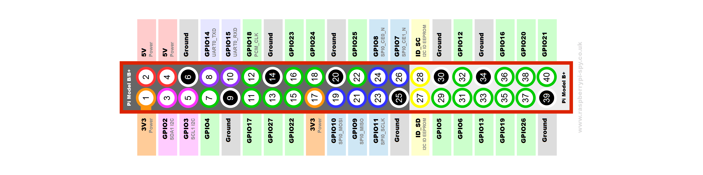

# OSCπ

Control your [Raspberry Pi](http://www.raspberrypi.org/)
with [OSC](http://opensoundcontrol.org/).

## Synopsis

Run `osc-pi` on your RPi, then send it OSC messages. The default port is 7433
and it responds to the following messages:
- `/set i $pin`
- `/clear i $pin`

Where `$pin` is the GPIO number, not the RPi's P1 pin number. (i.e. 4 not 7)

## Requirements
- A Raspberry Pi revision 2. (It's probably not difficult to support v1, send
  me an email if you need that). I think it works with newer versions too, e.g.
  the Zero, but I haven't tested.
- [liblo >= 0.28rc](http://liblo.sourceforge.net/).
  As of 2017-04-01 the Raspbian package `liblo-dev` has [a bug](https://github.com/radarsat1/liblo/issues/23),
  so you have to build it by hand. 
- [bcm2835](http://www.airspayce.com/mikem/bcm2835/index.html). (Tested with version 1.34)
- For running the tests only, you need [gmock](https://code.google.com/p/googlemock/).
  I only do this on my laptop.

Tested with the default g++ on Raspbian which is currently gcc 4.9.

Building should be as simple as installing the two dependencies
(`./configure; make; make install` in their respective directories)
and then typing `make`.

The makefile isn't full-blown autoconf or anything quite that smart, but it
should be easy enough to tweak to use your include paths if you install the
dependencies somewhere weird.

## Future directions
Because you often don't have a lot of control over the structure of the
messages you can send from an OSC gui builder (e.g.
[TouchOSC](http://hexler.net/software/touchosc)) or
[Control](http://charlie-roberts.com/Control/), it will need to be easier to
set up custom OSC paths. Maybe a config file. Maybe just an easily-edited
function. There shall be refactoring!

Either way, there's a need to flesh out the OSC messages we accept.

## License
Copyright 2013- Hans Fugal

Redistribution and use in source and binary forms, with or without
modification, are permitted provided that the following conditions are met:

1. Redistributions of source code must retain the above copyright notice, this
list of conditions and the following disclaimer.

2. Redistributions in binary form must reproduce the above copyright notice,
this list of conditions and the following disclaimer in the documentation
and/or other materials provided with the distribution.

3. Neither the name of the copyright holder nor the names of its contributors
may be used to endorse or promote products derived from this software without
specific prior written permission.

THIS SOFTWARE IS PROVIDED BY THE COPYRIGHT HOLDERS AND CONTRIBUTORS "AS IS" AND
ANY EXPRESS OR IMPLIED WARRANTIES, INCLUDING, BUT NOT LIMITED TO, THE IMPLIED
WARRANTIES OF MERCHANTABILITY AND FITNESS FOR A PARTICULAR PURPOSE ARE
DISCLAIMED. IN NO EVENT SHALL THE COPYRIGHT HOLDER OR CONTRIBUTORS BE LIABLE
FOR ANY DIRECT, INDIRECT, INCIDENTAL, SPECIAL, EXEMPLARY, OR CONSEQUENTIAL
DAMAGES (INCLUDING, BUT NOT LIMITED TO, PROCUREMENT OF SUBSTITUTE GOODS OR
SERVICES; LOSS OF USE, DATA, OR PROFITS; OR BUSINESS INTERRUPTION) HOWEVER
CAUSED AND ON ANY THEORY OF LIABILITY, WHETHER IN CONTRACT, STRICT LIABILITY,
OR TORT (INCLUDING NEGLIGENCE OR OTHERWISE) ARISING IN ANY WAY OUT OF THE USE
OF THIS SOFTWARE, EVEN IF ADVISED OF THE POSSIBILITY OF SUCH DAMAGE.
